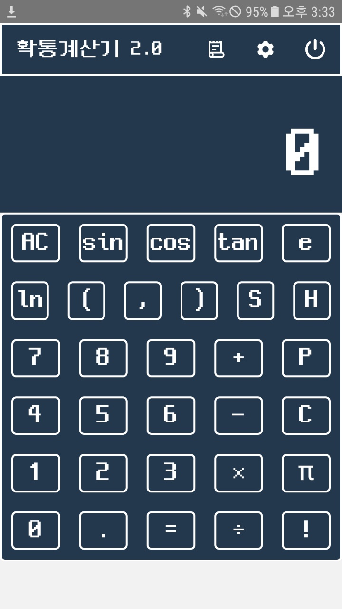
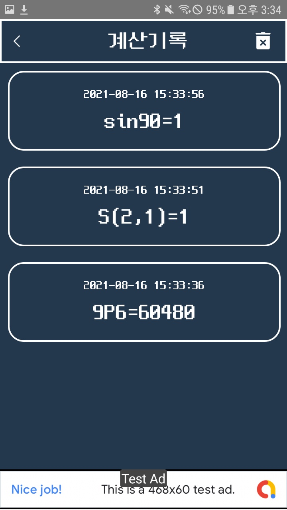
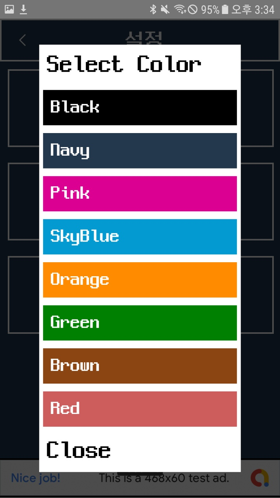
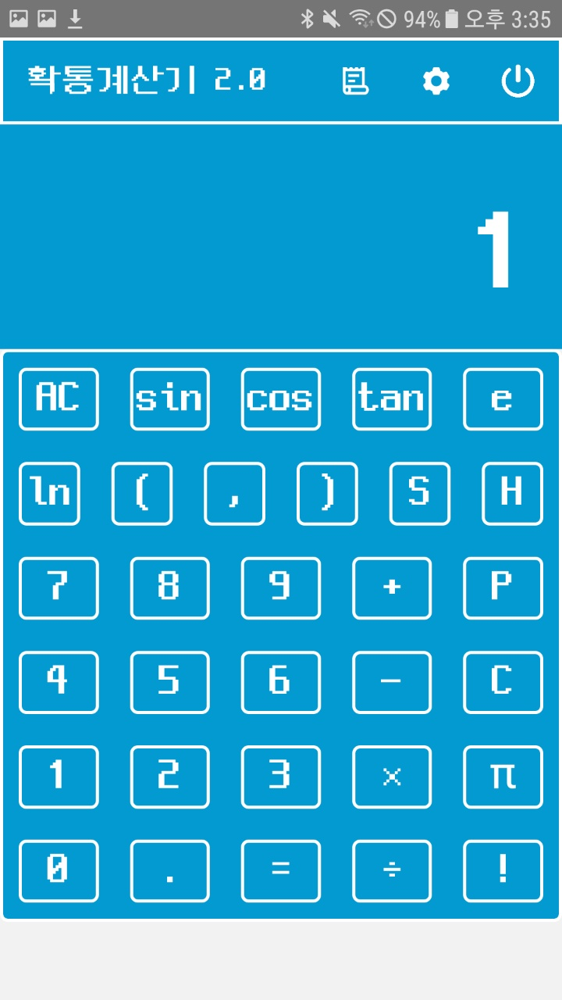
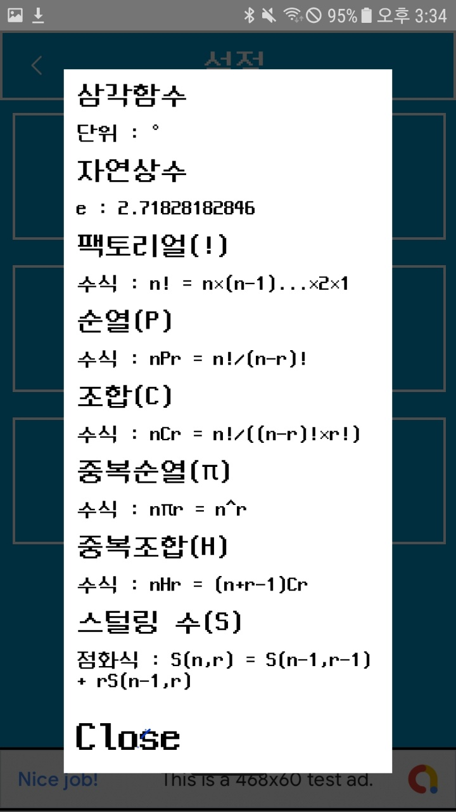

# 확통계산기 2.0

한국 고등학교에 맞는 확률과 통계 과정을 기준으로 기존 계산기에서 여러가지 계산을 할 수 있도록 기능을 추가해 출시했습니다
기존 1.0.x 에서는 단순히 순열, 조합, 중복 순열, 중복 조합 이외의 계산은 지원하지 않았지만, 피드백 이후 2.0 버전에 계산기 기능을 그대로 사용할 수 있도록 디자인했습니다.

# 기술스택

- React Native
- React-Redux

# 예시 이미지

